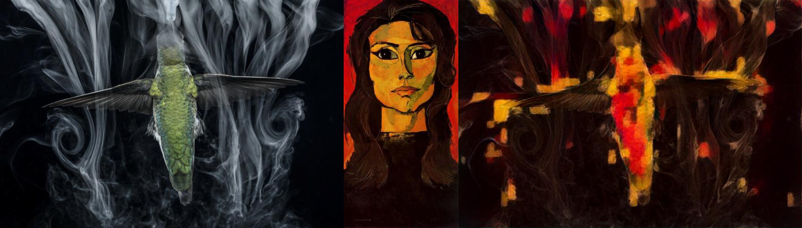
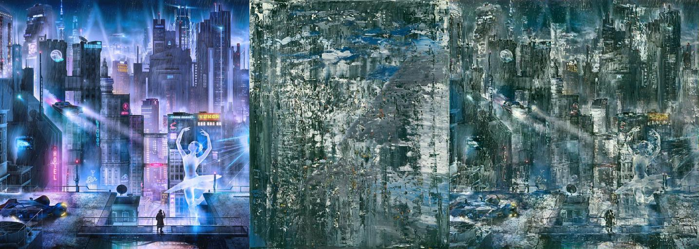
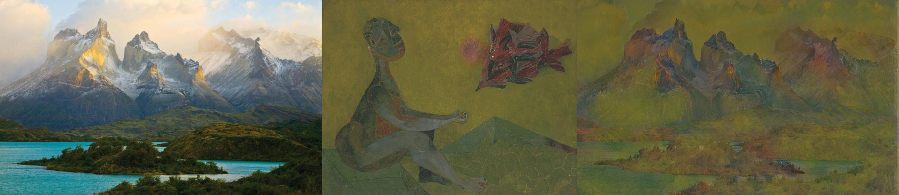
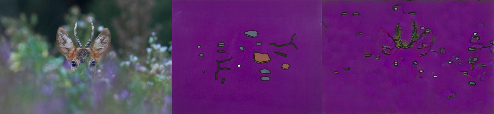

# Image artifier
### The goal of this project is to perform a high quality style transfer on images, where the style image is selected automatically from a large dataset of artwork - this makes for interesting experiments since I'm getting very varied and often unexpected matches.Once the style image is found I'm using style from patches that are the most similar to the content image to perform the transfer, this is different from the Gatys paper and inspired by the paper: [Deep Painterly Harmonization](https://arxiv.org/abs/1804.03189)

High level steps of the algorithm:
* Precompute vgg16 conv5_3 activations for 50 thousand images downloaded from [WikiArt.org](https://www.wikiart.org/). I'm serializing all the activations to files so I'm able to search through them in reasonable time.
* For a given content image I'm computing the conv5_1 activations. Then for each activation I'm considering it's neighbours to get 3x3 patches (with 512 stack channels).
* For each style image I compute cosine similarity across all the patches and select from the style the ones that are nearest to the content. The sum of these similarities is my measure of image similarities.
* The result of this process gives me a style image that doesn't necessarily look like the content image but can be stiched together into something that does.
* I rearange the patches according to their matching positions, upscale them to get the original style image pixel values and use that as the starting point for the training process.
* The loss function has three parts: content loss, style loss and total variation loss.
* The content loss is the usual L2 norm on activations. I'm using conv4_1 for that.
* For the style loss I again match the patches of activations, this time on the conv4_1 and then propagate the same matches down to the layers 3_1, 2_1 and 1_1 to use that to compute the Gram matrices. This is a simplified version of the second phase training from the "Deep Painterly Harmonization". The idea is to extract style only from the relevant portion of the image for a more harmonious effect. 
* The total variation loss adds a penalty for difference between neighbouring pixels to make the output a bit smoother.
* Finally I train it with Adam optimizer for 1000-2000 epochs

## Results
First column is the content image, second column is the style image found by the algorithm and the third one has the style transfer result.

## Running it
**PictureArtifier** notebook contains all the code, however it requires downloading 26GB dataset and takes several hours to precompute its activations. **SimpleTransfer** notebook has all the search functionality removed so you need to suply your own style image but runs under 5 minutes.
Tested with pytorch 1.0 on Ubuntu and Tesla K80 GPU

## Potential improvements
I've done a lot of experimentation, trial and error to get here, but still were many things I didn't get to try.
* Use [Histogram Loss](https://arxiv.org/pdf/1701.08893.pdf) this looks like it should fit right here and make for even better looking result.
* Pretrain the vgg on art. We are using a generic imagenet here, we could train it on the same wikiart dataset to make it better in understending art styles.
* Use an image detector to generate masks and have per mask gram matrices. I already try to keep the styles localized but still in the end styles from different parts can blend for unnatural results. Using something like r-cnn to segment the image first would be interesting.
* Faster searching for candidates. The similarity function I'm using is very expensive, doing N^2 comparisons across all activations (even though we do it in a single large matrix operation). There is probably some simpler heuristic that would work well enough.
* Consider rotations when matching style patches for better fitting pieces
* Image pre/post processing. I knew very little about working with images when I started this. There might be tricks to make it look better. The painterly harmonization paper talks about chrominance denoising but I didn't have time to learn what that is.
* Explore hiperparameters. Style transfer can be very sensitive to weights we use for all the losses. Currently I mostly use the same for all the images. Having a more robust way to adjust them would be great.
